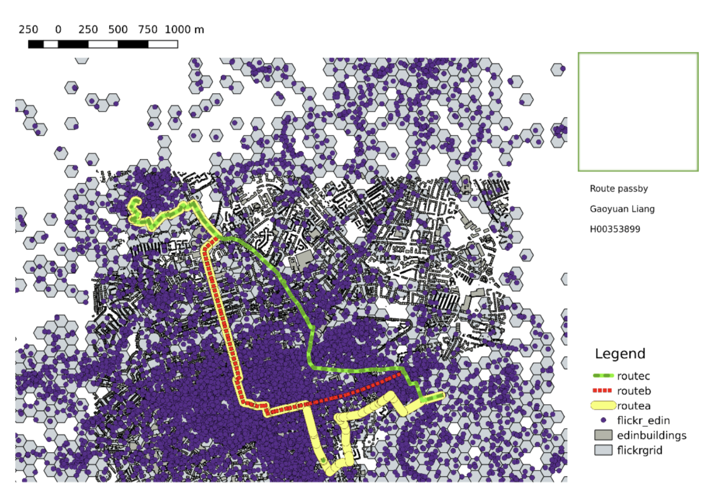
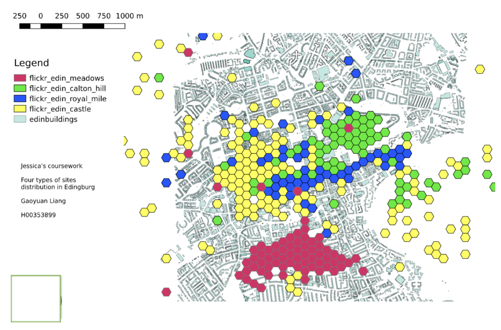

# gis project

analyzing flickr photo data by geo-locations of these photos, by using GIS technologies, including PostgreSQL, PostGIS, QGIS







```sql

drop table if exists route_line_length;
create table route_line_length as 
select geom, st_length(geom) as line_length, 'routea' as route_name  from routea 
union all 
select geom, st_length(geom) as line_length, 'routeb' as route_name  from routeb
union all 
select geom, st_length(geom) as line_length, 'routec' as route_name  from routec;


drop table if exists route_length;
create table route_length as 
select route_name, sum(line_length) as route_length
from route_line_length
group by route_name;


select * from route_length;
select route_length.route_name, 
route_photo_count.photo_count/route_length.route_length popularity,
route_length.route_length, 
route_photo_count.photo_count
from route_length
join (
	select route_name, count(*) as photo_count
	from (
		SELECT flickr_edin.*, route.route_name
		FROM flickr_edin 
		JOIN route_line_length as route ON 
		ST_INTERSECTS(flickr_edin.geom,ST_BUFFER(route.geom,25))
	) photo_over_route
	group by route_name
) route_photo_count
on route_length.route_name = route_photo_count.route_name
order by route_photo_count.photo_count/route_length.route_length desc;
```
